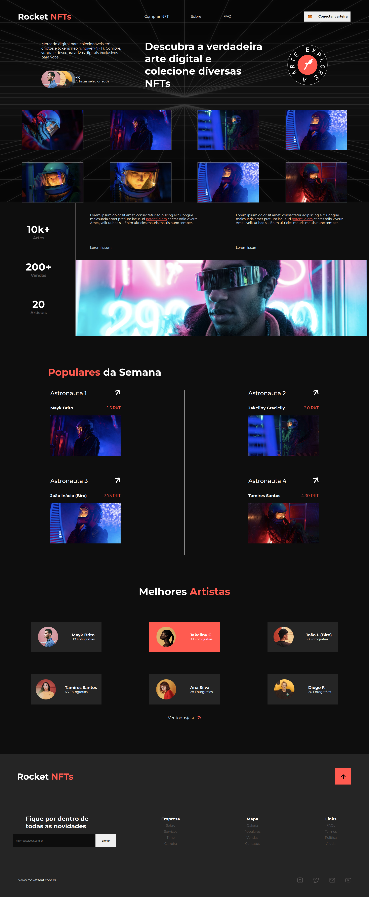

# Rocket NFTs

## [Read this page in English](https://github.com/VTramon/Rocket-NFTs/blob/main/README-en.md)

<br/>

---

## Sobre:

### Um um dos desafios disponiveis na plataforma da <b>RocketSeat</b>, com a tematica de NFTs. Este site é uma Single-page application construida apenas com HTML e CSS.

<br/>

---

<br/>

## Como usar:

<br/>

### 1. Clone esse repositório

```
git clone https://github.com/VTramon/Rocket-NFTs.git
```

### 2. Abra o arquivo index.html com o seu browser.

<br/>

---

<br/>


